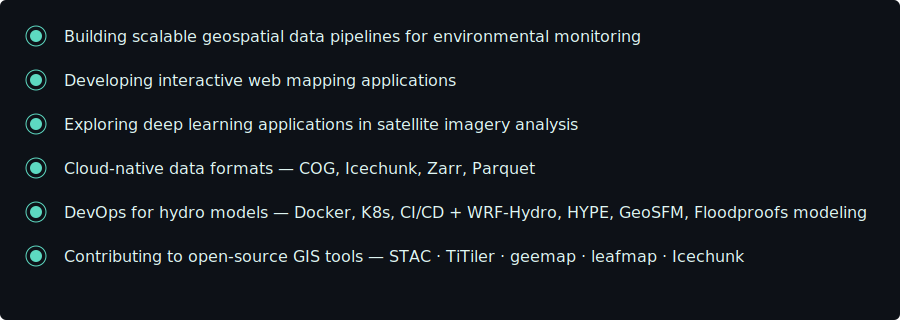

<!-- ANIMATED BANNER — code-screenshot hero, cycling job roles inside -->

  

---

## About Me

<table>
<tr>
<td width="45%" align="center">
  
</td>
<td width="55%" valign="top">

**Geospatial Information Science / Systems Researcher** specializing in leveraging big geospatial data and cloud computing to solve global spatial challenges. I help decision-makers through insightful spatial analysis and predictive modeling.

**Core Expertise:**
- Geospatial Data Science & Big Data Analytics
- Earth Observation & Remote Sensing
- AI/ML for Spatial Analysis & Predictive Modeling
- Web Development & Geospatial APIs
- Database Design & Spatial Databases
- Cloud Computing (GEE, AWS, GCP)

</td>
</tr>
</table>

---

## 🛠️ Tech Stack

<table>
<tr>
<td align="center" width="170"><b>🐍 Languages</b></td>
<td>

</td>
</tr>
<tr>
<td align="center"><b>🛰️ GIS & Remote Sensing</b></td>
<td>

</td>
</tr>
<tr>
<td align="center"><b>🧠 Machine Learning</b></td>
<td>

</td>
</tr>
<tr>
<td align="center"><b>🌊 Hydrology & Climate</b></td>
<td>

</td>
</tr>
<tr>
<td align="center"><b>🌐 Web & Databases</b></td>
<td>

</td>
</tr>
<tr>
<td align="center"><b>☁️ Cloud & DevOps</b></td>
<td>

</td>
</tr>
</table>

---

## 🎯 Current Focus

  

---

🐞

  

---

## 🤝 Let's Connect

  
  
  
  

<!-- ANIMATED FOOTER — connected Earth · city · water scene -->

